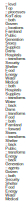

\clearpage

# Introduction

My two previous papers Triple System Analysis ( \tsa) and Adaptive Analysis ( \trs) explain how to use multi-level knowledge graphs for system analysis [@h_triple_2023] [@h_adaptive_2024].  Flow Visualization ( \ada) simplifies the symbals of the combined material/data flow model of \trs.  Read \tsa, \trs, and  \ada in order.

## Human Cognition First

{#fig:top s=.63}

We tend to work with systems backwards.  We look at the exhaust data from systems and hope to understand our direction, when we should really be focusing on where we are, where we want to go, and what dangers lie on our route before looking at the currents propelling our boat. Our systems should conform to our needs, not the needs of a provider, framework or existing systems.  There can be some savings in the short-term by going with the flow and purchasing the dominant service; however, when rapid change in requirements and features are needed to adapt to new situations, the technical debt accumulated by not leading with human cognition increases the risk of capsizing in the rapids. 

To get our bearings, humans can consider roughly 3 classes of objects related in one dimension, which can be seen as players, tools, and teams towards a common goal [@tomasello_understanding_2005].  We have limits on how much information we can consider in real-time to make decisions [@zheng_unbearable_2025].  What form of knowledge works best for the thin layer of communication that comprises our conscious mind [@murphy_propofol_2011] [@noauthor_decoding_nodate]?  Semiotics are cognitive shortcuts that can help.  I use icons for \tsa, \trs, and \ada, rather than titles, to make it clear that I mean the idea of the entire paper.   I use other conventions in the model to help the reader understand complex systems without dense dialog.  I have had professional success using knowledge graphs and semiotics in the form of Gane and Sarson structured systems analysis [@h_triple_2023] [@gane_structured_1977].  I've spent much of my time since then trying to understand why it worked so well, and developing tools, constraints, and methods that helped with the challenges. 

[@Fig:top] Shows the set of symbols used in my combined material and data flow model. The rounded blue boxes are transformations of data or materials.  The teal boxes are agents that are the sources or sinks of data or materials.  The reddish-brown boxes store data or materials at rest.  Each symbol is a node that is connected with other nodes via an edge.  Combined, this, is called a graph.  Besides color and node shape, dotted lines within the node represent data.  Solid lines represent materials.  As I explained in \trs, data flow diagrams are behind agents that operate transforms.  This is why I think it is OK to mix the nodes, as most of the function is behind the screens, the black box of the device or report that assists the transform. Magenta dots in the corner of a transform/process node mean the node can be expanded by clicking.  An orange dot means that notes and narrative will show with a pointer hover.  A blue dot in the lower right corner means there is a connection to the associated full data flow.

# Operations

{#fig:gs s=3}

## Graphs


### Creating a Graph from Stack Graph Format

In \tsa I wrote about the whiteboard technique to gather information collaboratively.  I also wrote about how these ideas can be thought of as mind mapping, and even gave an example of how to export a mind map directly to triples.  \trs introduced graph stack format.  Let's use that to create the graph in [@Fig:top] .
 
Lorem ipsum dolor sit amet, consectetuer adipiscing elit. Ut purus elit, vestibulum
ut, placerat ac, adipiscing vitae, felis. Curabitur dictum gravida mauris. Nam
arcu libero, nonummy eget, consectetuer id, vulputate a, magna. Donec vehicula
augue eu neque. Pellentesque habitant morbi tristique senectus et netus et
malesuada fames ac turpis egestas. Mauris ut leo. Cras viverra metus rhoncus
sem. Nulla et lectus vestibulum urna fringilla ultrices. [@Fig:gs]  Phasellus eu tellus sit
amet tortor gravida placerat. Integer sapien est, iaculis in, pretium quis, viverra
ac, nunc. Praesent eget sem vel leo ultrices bibendum. Aenean faucibus. Morbi
dolor nulla, malesuada eu, pulvinar at, mollis ac, nulla. Curabitur auctor semper
nulla. Donec varius orci eget risus. Duis nibh mi, congue eu, accumsan eleifend,
sagittis quis, diam. Duis eget orci sit amet orci dignissim rutrum.

Nam dui ligula, fringilla a, euismod sodales, sollicitudin vel, wisi. Morbi auctor
lorem non justo. Nam lacus libero, pretium at, lobortis vitae, ultricies et, tellus.
Donec aliquet, tortor sed accumsan bibendum, erat ligula aliquet magna, vitae
ornare odio metus a mi. Morbi ac orci et nisl hendrerit mollis. Suspendisse ut
massa. Cras nec ante. Pellentesque a nulla. Cum sociis natoque penatibus
et magnis dis parturient montes, nascetur ridiculus mus. Aliquam tincidunt urna.
Nulla ullamcorper vestibulum turpis. Pellentesque cursus luctus mauris.
Nulla malesuada porttitor diam. Donec felis erat, congue non, volutpat at,
tincidunt tristique, libero. Vivamus viverra fermentum felis. Donec nonummy
pellentesque ante. Phasellus adipiscing semper elit. Proin fermentum massa ac
quam. Sed diam turpis, molestie vitae, placerat a, molestie nec, leo. Maecenas
lacinia. Nam ipsum ligula, eleifend at, accumsan nec, suscipit a, ipsum. Morbi
blandit ligula feugiat magna. Nunc eleifend consequat lorem. Sed lacinia nulla
vitae enim. Pellentesque tincidunt purus vel magna. Integer non enim. Praesent
euismod nunc eu purus. Donec bibendum quam in tellus. Nullam cursus pulvinar
lectus. Donec et mi. Nam vulputate metus eu enim. Vestibulum pellentesque
felis eu massa.

Quisque ullamcorper placerat ipsum. Cras nibh. Morbi vel justo vitae lacus
tincidunt ultrices. Lorem ipsum dolor sit amet, consectetuer adipiscing elit. In
hac habitasse platea dictumst. Integer tempus convallis augue. Etiam facilisis.
Nunc elementum fermentum wisi. Aenean placerat. Ut imperdiet, enim sed
gravida sollicitudin, felis odio placerat quam, ac pulvinar elit purus eget enim.
Nunc vitae tortor. Proin tempus nibh sit amet nisl. Vivamus quis tortor vitae
risus porta vehicula.

Quisque ullamcorper placerat ipsum. Cras nibh. Morbi vel justo vitae lacus
tincidunt ultrices. Lorem ipsum dolor sit amet, consectetuer adipiscing elit. In
hac habitasse platea dictumst. Integer tempus convallis augue. Etiam facilisis.
Nunc elementum fermentum wisi. Aenean placerat. Ut imperdiet, enim sed
gravida sollicitudin, felis odio placerat quam, ac pulvinar elit purus eget enim.
Nunc vitae tortor. Proin tempus nibh sit amet nisl. Vivamus quis tortor vitae
risus porta vehicula.

Fusce mauris. Vestibulum luctus nibh at lectus. Sed bibendum, nulla a faucibus
semper, leo velit ultricies tellus, ac venenatis arcu wisi vel nisl. Vestibulum
diam. Aliquam pellentesque, augue quis sagittis posuere, turpis lacus congue
 
\setstretch{.5}
\vspace{10pt}
```{#lst:mod .javascript .numberLines}

``` 
\setstretch{1}

\clearpage

# References

<div id="refs"></div>

\newpage

\

\newpage