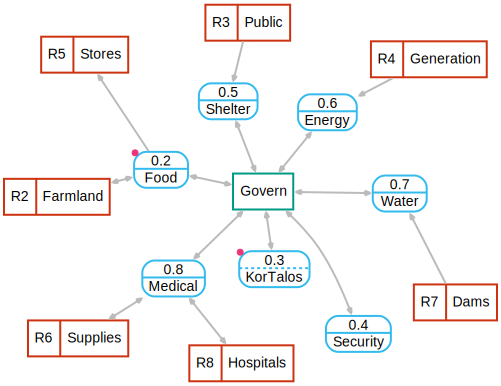

# Making Sense of Material and Data Flow

Civilization is moving fast.  Our progress is causing damage to ourselves and the biosphere [@greenspoon_global_2023]. The explosive growth of data involved in modern experience, coupled with the extremely complex global supply chain of materials and energy, means that participating in design, operations and governance is overwhelming and unlikely for most.  We feel like we are participating. We ask questions about when we will arrive. We make demands of the driver for comfort, entertainment, bathroom breaks and reassurance.  We add sensors and artificial intelligence to the car as it continues on its destructive path. We have so much invested, and are moving so fast, that we are stuck as passengers.  Rather than an identifiable driver, we ask the ***car*** where to go and what to do.  The automobile companies tell us we don't need maps.  We just need to subscribe to a car service, and it will provide answers about the journey. Our free journey app is a frictionless experience as we accelerate on our destructive journey.  As we mature, we begin to question the whole idea of progress, the reason for our journey [@project_development_2024].  

{#fig:top s=.63 a=r}

The most effective way to change complex systems is through ideology and culture, rather than tweak and primp the car and sensors [@meadows_leverage_1999].  Culture cradles us, and provides more direction than our real-time cognition [@tomasello_understanding_2005] [@zheng_unbearable_2025].  It is unlikely we can change while the car is moving.  Luckily for us, business-as-usual is not sustainable.  There will be pauses in motion as parts of our complex system collapses, emerges, and collapses again with varying cadence.  During the pauses between collapse and emergence, we will have opportunities to change. A map can help us make sense of the journey, and establish where we are, where we want to go, and how to get there.   Triple System Analysis (\tsa) and Adaptive Analysis (\trs) explain how to use multi-level maps to understand systems [@h_triple_2023] [@h_adaptive_2024].  This how-to guide (\ada) builds on those ideas, but constrains  the map to  necessary functional elements of material and data flow like [@Fig:top].  

## Scope of This Paper

I don't pretend that maps will solve our problems, or detail what culture and ideology will be needed to refactor and change our systems.  Others have explored these issues in the context of our immediate crises [@hagens_great_2022] [@tedx_talks_end_2023] [@oguzcan_connections_2021] [@john_vervaeke_psychological_2023] [@noauthor_huxley_1958].  I do have professional experience creating logical data flow maps as part of system analysis  [@h_about_2023].  I have leveraged that experience and focused on extending to material and data flow in a simple way, and will limit the rest of that paper to that scope.

## Data

Data might live on index cards at a library, a computer hard disk, as memories of childhood, or shared cultural forms in our dreams [@samson_evidence_2023].  Data flows in our daily lives as we run reports, write in our diary, account for money, message our friends, maintain contacts, and many other things that rely on other services to process and store our data.  Those services rely on others.  Restaurants often require data flow to accept customers, as orders  and payment are handled by external services.  When there is a network interruption, business grinds to a halt.  Data flow maps were introduced in the 1970s to analyze complicated data processing, and were proven to be an effective cognitive aid  [@gane_structured_1977].  

## Materials

Supply chains of production and distribution of materials like eggs, steel, mobile phones or lettuce can cause significant disruption when interrupted.    Energy is routed much like materials, and in many cases is directly related to materials [@levi_mapping_2018].  

Services can be mapped like materials.  A doctor agent might provide operational intelligence to transform materials like vaccines, and transform experience and memories into care at a clinic location.

## Map Symbols

{#fig:key s=1.2 a=r}

The rounded rectangle blue nodes shown in [@Fig:key] are transformations.  The teal rectangle nodes are agents that are the sources or sinks of data or intelligence.  The reddish-brown nodes store data or materials at rest.  Dotted lines within the node designate data.  Solid lines designate materials.  As I explained in \trs, data flow diagrams are behind agents that operate transforms.  This is why I think it is OK to mix the nodes, as most of the function is behind the screens, the black box of the device or report that assists the transform. Magenta dots in the corner of a transform/process node mean the node can be expanded by clicking.  An orange dot means that notes and narrative will show with a pointer hover.  A blue dot in the lower right corner of a material transform means there is a connection to the associated full data flow.


# Map Presentations
## Simple Web
 Let's start with the graph stack format introduced in \trs to create the graph in [@Fig:top]. I'm going to assume that you can use NPM, or, at least can bribe a programmer with a beverage and food to help you [@noauthor_nodejs_nodate].  We will continue to build out more sophisticated features, but for now, create a blank directory, cd into it, and install text-model-dot, gsdot-svg, and http-server with NPM:

``` {#lst:first_graph  .txt .numberLines}
$ npm install text-model-dot gsdot-svg http-server
added 101 packages in 3s
```
 We now have a new directory called node_modules which contains the software.    It is also possible to go directly to the repository on GitHub and download the software, but getting used to NPM will help us later on [@h_acodrsttext-model-dot_2025].  Create a file named index.html in the directory with this content:
 
``` {#lst:index .html .numberLines}
<!DOCTYPE html><html lang="en"><title>Top</title>
<div id="map"></div>
<script type="module">
  import { model_to_dots } from "./node_modules/text-model-dot/text-model-dot.js"
  import { gsdot_svg } from "./node_modules/gsdot-svg/dist/gsdot-svg.bundle.js"
  async function main() {
    const model = await (await fetch('./node_modules/text-model-dot/example.txt')).text()
    const dot_lines = model_to_dots(model).dots["Top"];
    await gsdot_svg(dot_lines,'default','map');
  }
  main()
</script></html>
```

Start up a web server to see the graph:

``` {#lst:list_software .text .numberLines}
$ npx http-server
Starting up http-server, serving ./

http-server version: 14.1.1

http-server settings: 
CORS: disabled
Cache: 3600 seconds
Connection Timeout: 120 seconds
Directory Listings: visible
AutoIndex: visible
Serve GZIP Files: false
Serve Brotli Files: false
Default File Extension: none

Available on:
  http://127.0.0.1:8080
Hit CTRL-C to stop the server

```
Browse to   http://127.0.0.1:8080, and you'll see a graph like [@Fig:top].

\clearpage

# Road Trip Toolkit

## Local Documentation

The map is generated via JavaScript, CSS, and HTML.  Spin off a project right now to understand how to run documentation locally.  This can be done by running a local version of MDN Web Docs [@noauthor_mdn_nodate].  As of this writing (2025-03-09), the way I do it is I fork content and yari as parallel repositories.  (Note that there are some instructions that say to install yari as a subdirectory of content).  Then run:

```{#lst:yari .text .numberLines}
yarn install
yarn dev
```
To update later, change to the local repository and run:
```{#lst:yari_update .text .numberLines}
git pull origin main
yarn
yarn dev
```
Going forward, just use ```yarn start```.  Browse to http://localhost:3000 to see a local MDN.  Test by disconnecting from the Internet.

\clearpage


# References

<div id="refs"></div>

\newpage

\

\newpage